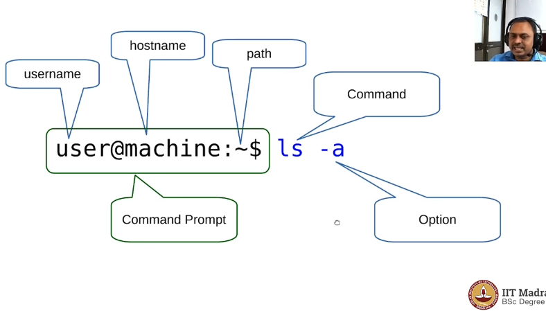

# System commands | Lecture 2
##  Prof. Gandham Phannikumar | IIT Madras
In this course 'system commands' we will learn to work with *Linux operating system*.<br><br>We will learn to use the linuxOS from *Command line environment*.<br>
<hr>

<sup>[ Side Flash ]</sup>


###### But Why would anyone like to work in Command Line environment?
<sup>[-Prof GP-] </sup>When we are working with **Linux operating system** we will be able to use it to its fullest potential when we are comfortable with *commands* and *command line environment*.<br><br>We can *combine* these commands to form a **script**.<br><br>And then we can use these scripts to be launched at specific times and thereby *automate* some of the task that we wolud like to do in the Linux environment.<br><br>So the command line environment should be seen as not only a way you type out *instructions* to the computer, but also as a path towards **automation**.
<hr>

## The Terminal emulator
To "type" commands and work with the operating system we need a *command line environment* which is provided by an app called *terminal emulator*.<br>There are several terminal emulators available in different distributions of the Linux OS.<br><br>Some of them are -
- **Terminal** in ubuntu (available GNOME Environment and highly customizable).
- **Exter**.
- **Guake** (can be activated and deactivated with F12, once it is installed it will remain in the background listening to your commands.You can open or close it at your wish).
- **konsole** (mainly available in KDE environment of the Linux OS).

## The command prompt 
When we open the terminal emmulator we will notice a string like

```bash

user@machine:~$

```

This string is called *command prompt*. We will discuss its details in a moment.<br> Following the command prompt we notice a dippering textbar, it represents that the *shell* is asking for the command to enter.

<hr>

<sup>[ Side Flash ]</sup>

###### What is 'shell'?

*Shell* is another essential program present in any OS. It sits just behind the *terminal emulator* and provides the Command Line Interface (CLI) for users to interact with the Operating System.<br>

The *Terminal emulater* itself is an intergrated part of the *shell*.<br>

The *Shell* takes the input from the user via GUI like *terminal emulator* and executes commands, launches programs, manages files, and controls system processes.<br>

In simple words we can say that the *Shell* is a command line interface (**CLI**) that interprets user commands and interacts with the **operating system**.

Few examples of the shell available for use in LinuxOS are :<br>
- sh
- bash
- csh
- zsh

...others

These shells vary in terms of *syntax*, *features* and *capabilities* but their fundamental purpose is to *allow users to interact with the operating system via command-line interface*.

**Different operating system have different shells**

- Unix-like systems(including Linux) have shells listed above.
- In **Windows** there are severals shells for different purpose like.
    - *Windows shell* is responsible for graphical user interface.
    - *Command prompt* and more advanced *Windows powershell* proviodes command-line interface to interact with windows operating system.
- In macOS(uses Unix based architecture) we typically have *bash*. It also supports shells like *zsh*.

In this course we will work with the *bash* shell in LinuxOS.
<hr>

Now lets come back to *command-prompt*, the string that we noticed in the *terminal emulator* .

```bash
user@machine:~$ 
```
Lets discuss it in more detail.

The anatomy of *command prompt* is shown as follows:



We can type commands after the command prompt and interact with the operating system.

## Structure of a command

Bash commands can look both simple and complex. But however complex, they are composed of some basic simple elements. 

Let us see the basic elements which forms a bash command.

A typical command in the bash shell looks like :

```bash
user@machine:~$ command -option argument1 argument2
```
This **command-option-argument** model is very important.

- **command** 
    - This is the action or program that you want to execute.
    - These commands can be build-in shell commands, eg ```ls```, ```pwd```, ```ps```....
     - Or they can be external programs located in one of the directories listed in **PATH** enviroment variable(we will study about them afterwords). Example ```jupyter notebook``` , ```git``` , etc.
    
- **option**
    - They modify the behaviour of the command.
    - options are prifixed by hyphens
        - by single hyphen( - ) if the option is single letter(*short option*). eg. ```-l```, ```-a```, ```-h```, etc.
        - by double hyphen( -- ) if the option is a word (*long option*).<br> eg. ```--version``` , ```--help``` , ```--force```, etc.

- **arguments**
    - These provide additional information or specify the *targets*(input or output) for the command.
    - arguments can be *filename*, *directories*, *values*, *patterns*, etc.

<hr>

<sup>[ Fact ]</sup>
###### Some more but less common constituents the command structure.

Apart for the *command-option-argument* model a bash command can compose of some more constituents like :

- **Redirections**
    - ```<``` for input redirection (```commond < input_file```)
    - ```>``` for output redirection (``` command > output_file```)
    - ```>>``` for appending output to a file (``` command >> output_file```)
    - ```|``` (pipe) for sending the output one command as the input of another command (```command1 | command2```)

- **Commands separators** 
    - They separate the multiple commands on a single line.
    - ```;``` runs the commands sequentially, one after another, regardless of the success or faliure of previous commands.
    - ```&&``` executes the second command only if the first command succeeds (returns exit status 0).
    - ```||``` executes the second command only if the first command fails (returns a non-zero exit status).


<hr>
